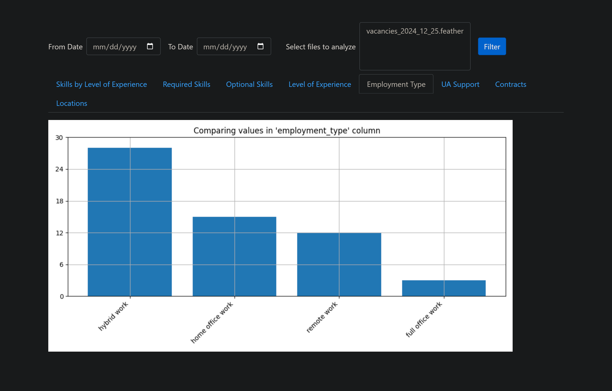

## Scraping Analyzing Job Site


This project scrapes job listings from Polish website [the.protocol](https://theprotocol.it/) to analyze the most in-demand
technologies for Python Developers in Poland. By generating statistics and visualizations, 
it helps users prioritize learning efforts for job interviews. Customize your 
scraping preferences and explore the latest market trends in technology demand.

### Key Learnings 
* **Web Scraping:** working with Selenium, Scrapy, CSS selectors and XPATH selectors.
* **Data Analysis:** and Visualization scraped data (working with Jupyter, matplotlib).
* **Task Management:** handling extensive tasks using Celery with Redis.
* **Containerization:** working and managing Docker containers. 

### Areas for Improvement
* **Data Storage Challenges:** scraped data is stored in .feather files within the 
    project’s local memory (static/scraping_results). This approach limits scalability
    and durability. Learning to work with cloud storage platforms or integrating a database
    solution would enhance data persistence and accessibility.
* **Optimizing Docker Containers:** The Docker images used in this project could be optimized
  further. By minimizing the container size and refining the build process, I could improve
  performance and resource efficiency.
* **Improving Project Structure & Code Quality:** the project structure could benefit from a more modular approach, following best practices for
  scalability and maintainability. Adhering more strictly to SOLID principles could help in 
  making the codebase cleaner, easier to extend, and more testable, particularly as the project grows in complexity.
* **Tests:** currently I am busy and it hard to find time to write tests.

## Features
* In `config.py` file, variable `POSITION` we can specify for which position are we looking for it can be
    `java`, `dev`, `javascript` developer etc. by default is `python`. Import is to enter it in lowercase.
* Scraping data using `Scrapy`, `Selenium`(for handling JSON rendering), `scrapy-selenium4` (allows integrating
  Selenium with Scrapy), creating own `ItemPipelines`, `Middlewares`, `Item` classes. And working with **CSS**
  selectors and **XPATH** syntax
* Data Base **MySQL** with one custom table `scraping_result_file_meta_data` for storing metadata about files
  which stores scraping data. But the files with scraping data we store on computer memory.
* Using **Celery** and **celery-beat** for running Scrapy spider every number of `SCRAPING_EVERY_DAYS`
    days.
* Working with `NLTK` tools and `fuzzywuzzy` and `regular expressions` to get words we need.
* Creating `analyzing/*` directory. Analyzing/Visualizing data I scraped using **Jupyter** and **matplotlib**
* Creating `web_server/*` directory. Web Application to interact with scraped data together with directory `analyzing`
* Using `Celery` in `web_server/tasks.py` to handle analyzing/visualizing scraping data.
* Creating `main_celery`. Celery configurations. Connecting to `Redis` broker messenger.
* Using `Nginx` as proxy server.
* Containerization with Docker/Docker-Compose.


## Installation
1. Clone git repository to your local machine:
```
    https://github.com/OlehOryshchuk/scraping_analyzing_jobsite.git
```
2. Copy the `.env.sample` file to `.env` and configure the environment variables
```
    cp .env.sample .env
```
3. Run command. Docker should be installed:
```
    docker-compose up --build
```
### Usage
To access the API, navigate to http://localhost:8000/scraping/diagrams in your web browser.

### Endpoints
Scraping and Analyzing Job Site endpoints

bk_id - is the book integer id
- `/scraping/diagrams` - returns celery task id.
- `/scraping/diagrams/diagrams_task_id` - receives celery task id and checks if response is ready in Celery.

## Web pages:





